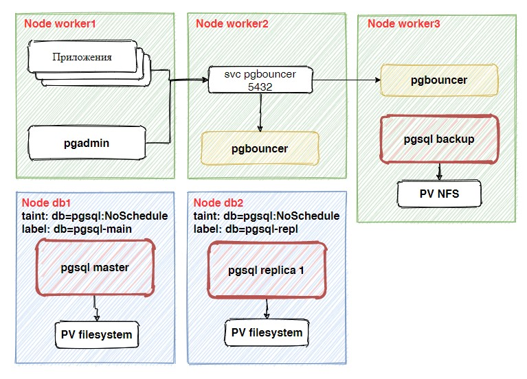

# Crunchy PostgreSQL Operator

[Документация](https://access.crunchydata.com/documentation/postgres-operator/latest/)

## Схема

## Подготовка нод

Вешаем заразы и метки на ноды кластера.

    kubectl taint nodes db1.k.erushnikov.ru db=pgsql:NoSchedule
    kubectl taint nodes db2.k.erushnikov.ru db=pgsql:NoSchedule
    kubectl label nodes db1.k.erushnikov.ru db=pgsql-main
    kubectl label nodes db2.k.erushnikov.ru db=pgsql-repl

Создаём директории для локальных PV:

    mkdir /var/pgsql-volume

Создаем namespace и деплоим оператор.

    kubectl create namespace pgo
    kubectl apply -f https://raw.githubusercontent.com/CrunchyData/postgres-operator/v4.6.2/installers/kubectl/postgres-operator.yml

Ждём пока приложение запустится.

На control node устанавливаем приложение.

    curl https://raw.githubusercontent.com/CrunchyData/postgres-operator/v4.6.2/installers/kubectl/client-setup.sh > client-setup.sh
    chmod +x client-setup.sh
    ./client-setup.sh

    cat <<EOF >> ~/.bashrc
    export PGOUSER="${HOME?}/.pgo/pgo/pgouser"
    export PGO_CA_CERT="${HOME?}/.pgo/pgo/client.crt"
    export PGO_CLIENT_CERT="${HOME?}/.pgo/pgo/client.crt"
    export PGO_CLIENT_KEY="${HOME?}/.pgo/pgo/client.key"
    export PGO_APISERVER_URL='https://192.168.218.174:31201'
    export PGO_NAMESPACE=pgo
    export PATH=$PATH:/root/.pgo/pgo
    EOF

Добавляем сервис типа NodePort. Если установлен ingress controller, можно создать ingress.

    kubectl apply -f 00-svc-nodeport.yaml

Проверяем подключение к API серверу оператора.

    # pgo version

Должны увидеть, что то типа:

    pgo client version 4.6.2
    pgo-apiserver version 4.6.2

## Создание кластера

Добавляем PV

    kubectl apply -f 01-pv-pvc.yaml

Создаём кластер

    kubectl apply -f 02-cluster.yaml

Смотрим пароль пользователя.

    pgo show user -n pgo base

Системные пользователи.

    pgo show user -n pgo base --show-system-accounts

Смотрим, куда можем подключаться клиентом psql.

    kubectl -n pgo get svc | grep 5432
    yum install postgresql

Подключаемся к БД.

    PGPASSWORD='пароль пользователя' psql -h 192.168.218.174 -p NODEPORT -U artur base

## Добавляем pgadmin.

Если делать, как написано в конфигурации, в нашем сетапе работать не будет.

    pgo create pgadmin -n pgo base

Задеплоим свой собственный pgadmin.

    kubectl apply -f 03-pgadmin.yaml

## Конфигурация один sql сервер

В файле [04-postgree-single.yaml](04-postgree-single.yaml) показано как развернуть один экземпляр
sql сервера.

Бекап подключает nfs PV и размещается на worker node. 

## Видео.

_Премьера 7 Мая 2021_

